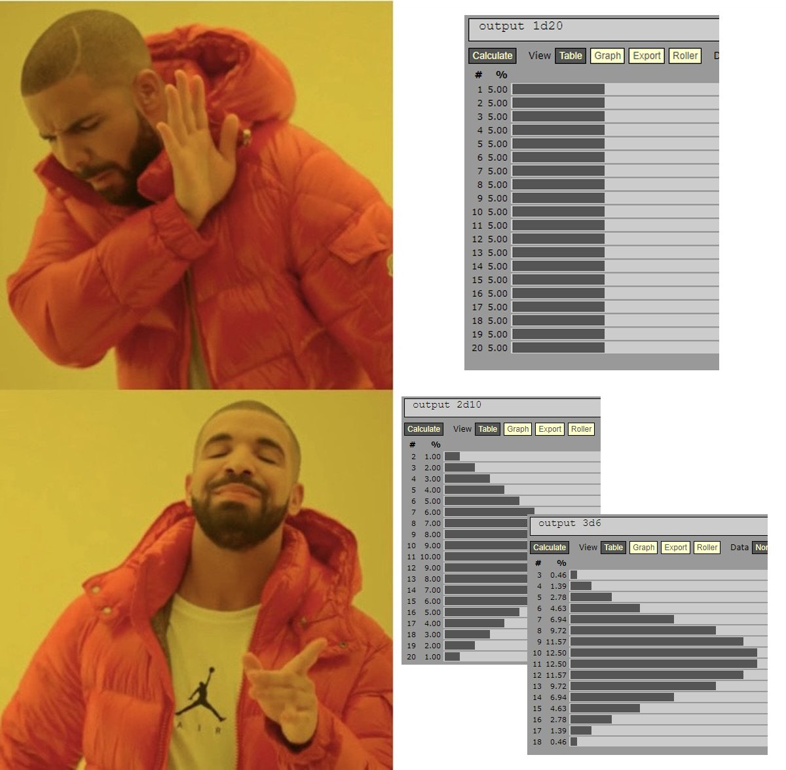

# Better Dice
###### by Cooper Whitley

## Overview
Inspired by a tweet by game designer Josh Sawyer praising curved probability of dice rolls for traditional rpg based video games, this is a dice tool utilizing standard DnD dice sets to bring weighted probability to your actual tabletop setup.

#### Inspiration

#### Technologies Used
- HTML
- CSS
- JavaScript

## User Stories
#### Minimum Viable Product
As a user...
- I want to select from a standard set of DnD dice
    - D20
    - D12
    - 2D10
    - D8
    - D6
    - D4
- I want to be able to 'roll' the dice with the result being determined by a weighted statistical normal distribution (bell curve) of possible outcomes
- I want the result to be displayed graphically
#### Stretch Functionality
- I want the result to be shown and saved in a user viewable log that stores the 10 most recent rolls and can be cleared by the user
- I want the graphic to be represented by dice
- I want the die/dice to be animated
- I want to choose a color theme
- I want to be able to input stat bonuses to be applied to a given roll
## Wireframes
#### Basic Layout
#### Functionality